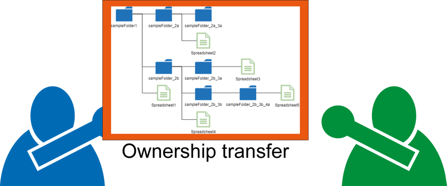

# OwnershipTransfer

<a name="top"></a>

[](LICENCE)

<a name="overview"></a>

# Overview

**This is a Google Apps Script library for achieving the ownership-transfer of the specific folder including the files and sub-folders using Drive API.**



<a name="description"></a>

# IMPORTANT: PLEASE BE CAREFUL THIS.

## **At first, please read this section**

## **<u>I cannot take responsibility for the problems occurred by this library. So when you use this library, please use it by according to your own decision and at your own responsibility.</u>**


### **This GAS library transfers the ownership of files and folders. For example, when the ownership of a file is transferred to other account, the file cannot be managed by the original user. And also, when the ownership of the specific folder is transferred to other account, all files ans sub-folders in the specific folder cannot be managed by the original user. PLEASE BE CAREFUL THIS. So when you use this library, at first, please test this library using a sample file and folder. PLEASE BE CAREFUL THIS.**

### **And also, the specification of ownership transfer might be updated by Google side in the future update. Because when I had tested this library, I could notice that the specification had been changed. [Ref](https://tanaikech.github.io/2020/07/10/transfer-of-owner-of-files-got-to-be-able-to-be-achieved-with-batch-requests-of-drive-api/) By this, I noticed that the transferred files had no parent folders, and also, the script was required to be modified. From this situation, when you use this script for your important files and folders, please be careful this. At first, PLEASE TEST THIS LIBRARY USING A SIMPLE FILE AND FOLDER.**

# Description

Recently, I had the situation that it is required to transfer the ownership of a folder including the files and sub-folders. When I manually transferred the ownership of the top folder from my account to other user's account, although the ownership of top folder could be transferred, my account is left as the writer. And also, the ownership of the files and sub-folders in the top folder was not changed, while the user is the writer. Although I do the same situation using the method of create.permissions in Drive API, the same result was obtained. In the current stage, unfortunately, by the simple method, the complete ownership-transfer of the file including the files and sub-folders cannot be achieved. From this situation, I created the script for achieving the complete ownership-transfer of the files and folders as a Google Apps Script library.

# Limitation

- Owner of the root folder of Google Drive cannot be transferred.
- When the owner of the files and folders is transferred, `sendNotificationEmail` cannot be `false`. [Ref](https://developers.google.com/drive/api/v3/reference/permissions/create)
- When the ownership of a lot of files and folders is transferred, after the script was finished, please wait for completely reflecting the transfer ownership. Please be careful this.
- The ownership of files and folders, that you are not the owner, cannot be transferred.
- When the ownership of the files and folders with other users are included as the writer and viewer is transferred, their permissions are kept even when the owner is changed.
- In the current stage, this library cannot be used for the shared Drive.

I sincerely hope this library is useful for you.

<a name="methods"></a>

# Methods

| Method                          | Description                                                                        |
| :------------------------------ | :--------------------------------------------------------------------------------- |
| [setFolder(object)](#setfolder) | Transfer the ownership of the specific folder including the files and sub-folders. |
| [setFiles(object)](#setfiles)   | Transfer the ownership of files. In this method, the folder cannot be used.        |

# Library's project key

```
1khX5L_Q0GV8uh2r8-0dj4SA-K3ONOic_lciQrxIE8qVKjRUfpctB15jz
```

# How to install

## Install this library

- Open Script Editor. Click as follows:
- -> Resource
- -> Library
- -> Input the Script ID in the text box. The Script ID is **`1khX5L_Q0GV8uh2r8-0dj4SA-K3ONOic_lciQrxIE8qVKjRUfpctB15jz`**.
- -> Add library
- -> Please select the latest version
- -> Developer mode ON (Or select others if you don't want to use the latest version)
- -> The identifier is "**`OwnershipTransfer`**". This is set under the default.

[You can read more about libraries in Apps Script here](https://developers.google.com/apps-script/guide_libraries).

## Enable Drive API

In this library, Drive API is used. So [please enable Drive API at Advanced Google services](https://developers.google.com/apps-script/guides/services/advanced#enabling_advanced_services).

## About scopes

This library uses the following scope. This is installed in the library, and nothing further is required from the user.

- `https://www.googleapis.com/auth/drive`
- `https://www.googleapis.com/auth/script.external_request`

## Additional libraries

This library also uses the following 2 GAS libraries.

- [BatchRequest](https://github.com/tanaikech/BatchRequest)
- [FilesApp](https://github.com/tanaikech/FilesApp)

# Methods

<a name="setfolder"></a>

## 1. setFolder(object)

This method is used for transferring the ownership of the specific folder including the files and sub-folders. (The ownership of the root folder cannot be transferred.)

### Sample script 1

In this sample script, the ownership of the specific folder of `folderId` is transferred from `fromOwnerMail` to `toOwnerMail`. The transferred folder is put in the root folder of the transferee. And also, the folder structure in the folder is kept.

```javascript
function myFunction() {
  const object = {
    folderId: "###",
    fromOwnerMail: "###@gmail.com",
    toOwnerMail: "###@gmail.com",
  };
  const res = OwnershipTransfer.setFolder(object);
  console.log(res);
}
```

- **`folderId`** : Folder ID you want to transfer the ownership.
- **`fromOwnerMail`** : Email address of the original owner.
- **`toOwnerMail`** : Email address of the transferee.

<a name="setfiles"></a>

## 2. setFiles(object)

This method is used for transferring the ownership of the files. **In this method, the folder cannot be used.**

### Sample script

In this sample script, the ownership of the files of `fileId` is transferred from `fromOwnerMail` to `toOwnerMail`. The transferred files are put in the root folder of the transferee.

```javascript
function myFunction() {
  const object = [
    {
      fileId: "###",
      fromOwnerMail: "###@gmail.com",
      toOwnerMail: "###@gmail.com",
    },
    {
      fileId: "###",
      fromOwnerMail: "###@gmail.com",
      toOwnerMail: "###@gmail.com",
    },
    ,
    ,
    ,
  ];
  const res = OwnershipTransfer.setFiles(object);
  console.log(res);
}
```

- **`fileId`** : File ID you want to transfer the ownership. In this method, in order to transfer a lot of files, please set the object as an array like above.
- **`fromOwnerMail`** : Email address of the original owner.
- **`toOwnerMail`** : Email address of the transferee.

---

# Response from this library

The returned value from this library is as follows.

```json
{
  "finished": [
    {
      "fileId": "###",
      "response": "###"
    },
    ,
    ,
    ,
  ],
  "errors": [
    {
      "fileId": "###",
      "response": "###"
    },
    ,
    ,
  ],
  "startTime": "2020-01-01T01:23:45.678Z",
  "processTime": 1.234
}
```

- **`finished`**: The files and folders which completely transferred the ownership.
  - `fileId`: The file ID and folder ID.
  - `response`: Raw returned value from the request to Drive API.
- **`errors`**: The files and folders which couldn't transfer the ownership because of the error.
  - `fileId`: The file ID and folder ID.
  - `response`: Raw returned value from the request to Drive API.

When `errors` has the values, you can check the error message at `response` and you can try to transfer the ownership again.

<a name="licence"></a>

# Licence

[MIT](LICENCE)

<a name="author"></a>

# Author

[Tanaike](https://tanaikech.github.io/about/)

If you have any questions or comments, feel free to contact me.

<a name="updatehistory"></a>

# Update History

- v1.0.0 (July 13, 2020)

  1. Initial release.

[TOP](#top)
